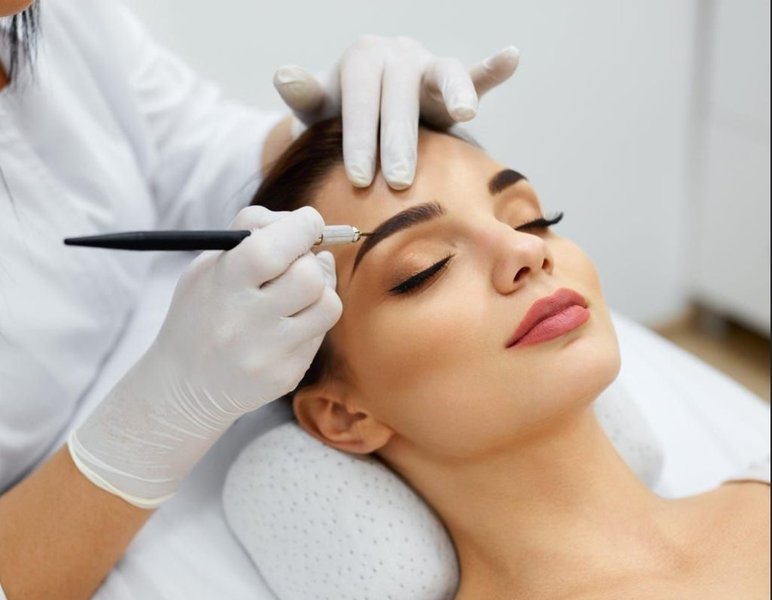
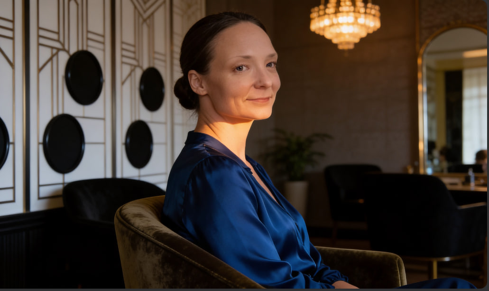

# КАК ЗАМЕНИТЬ КАРТИНКИ НА САЙТЕ - ПОДРОБНАЯ ИНСТРУКЦИЯ

## ВАЖНО: Картинки должны быть в папке images/

### Структура папок:
```
beauty-website/
├── images/
│   ├── hero.jpg          (главное фото - мама)
│   ├── brows.png         (фото бровей)
│   ├── lashes.png        (фото ресниц)
│   ├── manicure.jpg      (фото маникюра - опционально)
│   └── ...
├── css/
│   └── styles.css
├── js/
│   └── main.js
└── index.html
```

---

## СПОСОБ 1: Замена картинок через файловую систему

### Шаг 1: Откройте папку с картинками
```
C:\Users\bogda\Desktop\beauty-website\images\
```

### Шаг 2: Удалите старые картинки
- Выделите файл и нажмите `Delete`
- Или перетащите в корзину

### Шаг 3: Скопируйте новые картинки
- Перетащите новые файлы в папку `images`
- **ВАЖНО:** Назовите файлы латиницей:
  - `hero.jpg` (главное фото)
  - `brows.png` или `brows.jpg` (брови)
  - `lashes.png` или `lashes.jpg` (ресницы)

### Шаг 4: Обновите Git
Откройте терминал в папке `beauty-website`:
```powershell
cd beauty-website
git add images/
git commit -m "Обновил картинки"
git push origin main
```

### Шаг 5: Подождите Vercel
- Vercel деплоит через 1-2 минуты
- Проверьте: https://vercel.com/dashboard

---

## СПОСОБ 2: Замена картинок через VSCode

### Шаг 1: Откройте проект в VSCode
- File → Open Folder → выберите `beauty-website`

### Шаг 2: Замените файлы
- В панели файлов найдите папку `images`
- Перетащите новые файлы в папку `images`
- VSCode спросит "Replace" → нажмите **Yes**

### Шаг 3: Обновите Git
```powershell
cd beauty-website
git add images/
git commit -m "Обновил картинки"
git push origin main
```

---

## СПОСОБ 3: Если картинки не грузятся - используйте URL

Если не можете загрузить картинки локально, используйте URL:

### В index.html замените:
```html
<!-- Было -->


<!-- Стало - используйте URL -->

```

### Примеры готовых URL:
```html
<!-- Брови -->


<!-- Ресницы -->


<!-- Маникюр -->


<!-- Педикюр -->


<!-- Визаж -->

```

---

## ЧТО ДЕЛАТЬ ЕСЛИ КАРТИНКИ НЕ ГРУЗЯТСЯ

### Проверка 1: Имена файлов
- Должны быть латиницей: `hero.jpg`, `brows.png`
- НЕ кириллицей: `фото.jpg`, `брови.png`

### Проверка 2: Пути в HTML
```html
<!-- Правильно -->


<!-- Неправильно -->
     <!-- обратный слэш -->
    <!-- слэш в начале -->
   <!-- точка не нужна -->
```

### Проверка 3: Кэш браузера
- Нажмите `Ctrl+F5` для полного обновления
- Или откройте в режиме инкогнито `Ctrl+Shift+N`

### Проверка 4: DevTools
- Откройте `F12`
- Вкладка **Network**
- Обновите страницу
- Ищите статус 200 для картинок
- Если 404 - путь неправильный

### Проверка 5: Vercel деплой
- Зайдите на https://vercel.com/dashboard
- Проверьте что деплой успешный
- Если нет - нажмите **Retry Deployment**

---

## ОПТИМИЗАЦИЯ КАРТИНОК

### Размер файлов:
- **Главное фото:** 500-800 KB
- **Карточки услуг:** 200-400 KB
- **Максимальная ширина:** 800-1200px

### Форматы:
- **Фото:** JPG (меньше размер)
- **Изображения с прозрачностью:** PNG
- **Иконки:** SVG

### Инструменты для оптимизации:
1. **TinyPNG:** https://tinypng.com/
2. **Squoosh:** https://squoosh.app/
3. **Compressor.io:** https://compressor.io/

---

## ПОЛНЫЙ ЧЕКЛИСТ

- [ ] Картинки в папке `images/`
- [ ] Имена файлов латиницей
- [ ] Пути в HTML правильные
- [ ] Размер файлов оптимизирован
- [ ] Git обновлен
- [ ] GitHub обновлен
- [ ] Vercel деплоит
- [ ] Кэш браузера очищен

---

## БЫСТРЫЕ КОМАНДЫ

### Обновить все:
```powershell
cd beauty-website
git add .
git commit -m "Обновления"
git push origin main
```

### Только картинки:
```powershell
cd beauty-website
git add images/
git commit -m "Обновил картинки"
git push origin main
```

### Проверить статус:
```powershell
cd beauty-website
git status
```

---

## ЕСЛИ НИЧЕ НЕ ПОМОГАЕТ

### Полный сброс:
1. Удалите папку `images`
2. Создайте новую папку `images`
3. Скопируйте картинки
4. Обновите Git

### Или используйте URL:
- Замените все локальные пути на URL
- Это гарантированно сработает