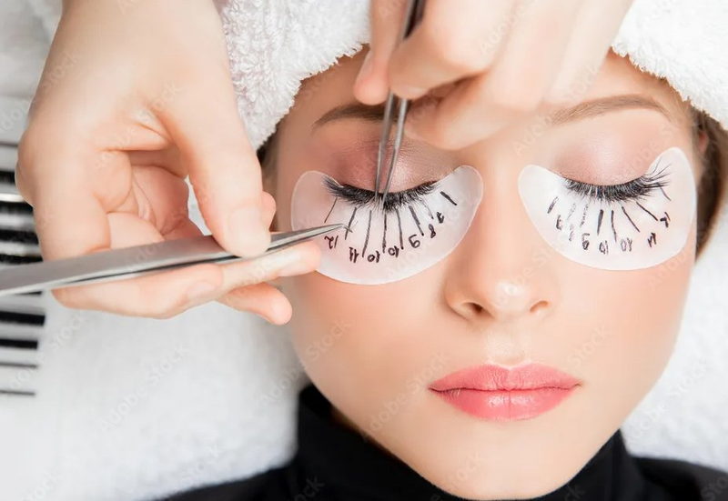

# 📸 Инструкция по замене фото на фото мамы

## Где находятся файлы сайта

Ваш сайт находится в папке:
**`C:\Users\bogda\Desktop\beauty-website\`**

## Как заменить фото мамы

### Шаг 1: Подготовьте фото

1. Возьмите фото мамы из тех, что вы прислали
2. Скопируйте фото в папку `C:\Users\bogda\Desktop\beauty-website\images\`
3. Переименуйте фото в `hero.jpg`

### Шаг 2: Обновите HTML

Откройте файл `C:\Users\bogda\Desktop\beauty-website\index.html` в текстовом редакторе.

Найдите строку (примерно строка 55):
```html

```

Замените на:
```html

```

### Шаг 3: Сохраните и проверьте

1. Сохраните файл `index.html`
2. Откройте `index.html` в браузере
3. Проверьте, что фото мамы отображается

## Как заменить фото услуг

### Для каждой услуги:

1. Скачайте красивые фото услуг на стоках:
   - [Unsplash - Маникюр](https://unsplash.com/s/photos/manicure)
   - [Unsplash - Педикюр](https://unsplash.com/s/photos/pedicure)
   - [Unsplash - Брови](https://unsplash.com/s/photos/eyebrows)
   - [Unsplash - Ресницы](https://unsplash.com/s/photos/eyelashes)
   - [Unsplash - Макияж](https://unsplash.com/s/photos/makeup)

2. Скачайте фото и сохраните в папку `C:\Users\bogda\Desktop\beauty-website\images\`:
   - `manicure.jpg`
   - `pedicure.jpg`
   - `brows.jpg`
   - `lashes.jpg`
   - `makeup.jpg`

3. Откройте `index.html` и найдите строки с фото услуг (примерно строки 80-120)

4. Замените ссылки на Unsplash на локальные файлы:

```html
<!-- Маникюр -->


<!-- Педикюр -->


<!-- Брови -->


<!-- Ресницы -->


<!-- Визаж -->

```

## Рекомендации по фото

### Размер и формат
- **Формат:** JPG или WebP
- **Размер Hero:** 500x650px (вертикальное)
- **Размер услуг:** 400x300px (горизонтальное)
- **Вес:** оптимизируйте до <100KB для каждого фото

### Где оптимизировать
- [TinyPNG](https://tinypng.com)
- [Squoosh](https://squoosh.app)
- [Compressor.io](https://compressor.io)

## Быстрая проверка

После замены фото:
1. Откройте `index.html` в браузере
2. Проверьте, что все фото отображаются
3. Убедитесь, что сайт выглядит хорошо на мобильном

---

**Готово! Ваш сайт теперь с личными фотографиями!**