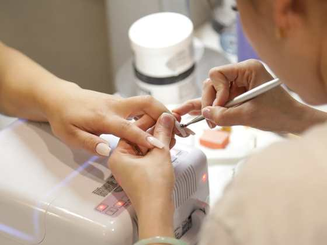
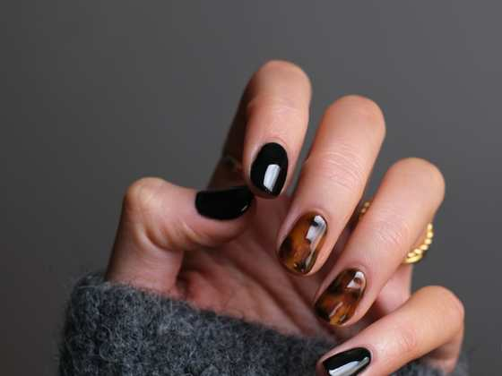
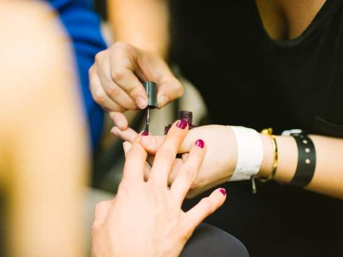

# 📸 Инструкция по замене изображений

## Как добавить фото мамы

### Шаг 1: Подготовьте фото
Используйте одно из предоставленных фото:
- Фото 1: Профиль в светлом топе
- Фото 2: В черном кружеве (теплый свет)
- Фото 3: В синей блузе (интерьер)
- Фото 4: Крупный план с серьгой
- Фото 5: С дочкой и попугаями

### Шаг 2: Скопируйте фото в папку проекта
1. Создайте папку `images` внутри `beauty-website`
2. Скопируйте выбранное фото в эту папку
3. Переименуйте фото в `hero.jpg`

### Шаг 3: Обновите HTML
Откройте `index.html` и найдите строку:

```html

```

Замените на:

```html

```

## Как добавить фото услуг

### Для каждой услуги:

1. Найдите красивые фото на стоках:
   - [Unsplash - Маникюр](https://unsplash.com/s/photos/manicure)
   - [Unsplash - Педикюр](https://unsplash.com/s/photos/pedicure)
   - [Unsplash - Брови](https://unsplash.com/s/photos/eyebrows)
   - [Unsplash - Ресницы](https://unsplash.com/s/photos/eyelashes)
   - [Unsplash - Макияж](https://unsplash.com/s/photos/makeup)

2. Скачайте фото и сохраните в папку `images`:
   - `manicure-v2.jpg`
   - `pedicure-v2.jpg`
   - `brows.png`
   - `lashes.png`
   - `makeup-v2.jpg`

3. Обновите ссылки в `index.html`:

```html
<!-- Маникюр -->


<!-- Педикюр -->


<!-- Брови -->


<!-- Ресницы -->


<!-- Визаж -->

```

## Рекомендации по фото

### Размер и формат
- **Формат:** JPG или WebP
- **Размер Hero:** 600x750px (вертикальное)
- **Размер услуг:** 400x300px (горизонтальное)
- **Вес:** оптимизируйте до <100KB для каждого фото

### Где оптимизировать
- [TinyPNG](https://tinypng.com)
- [Squoosh](https://squoosh.app)
- [Compressor.io](https://compressor.io)

### Советы
- Используйте качественные, светлые фото
- Избегайте слишком темных изображений
- Фото должны соответствовать минималистичному стилю сайта
- Лицо должно быть хорошо видно на hero-фото

## Быстрая проверка

После замены фото:
1. Откройте `index.html` в браузере
2. Проверьте, что все фото отображаются
3. Убедитесь, что сайт выглядит хорошо на мобильном
4. Проверьте скорость загрузки

---

**Готово! Ваш сайт теперь с личными фотографиями!**